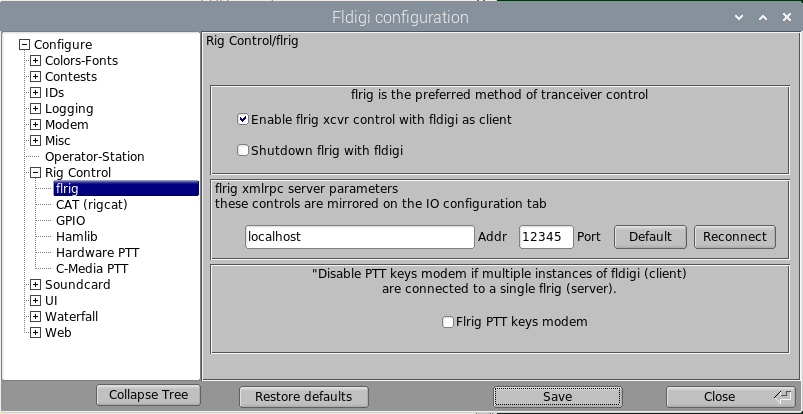
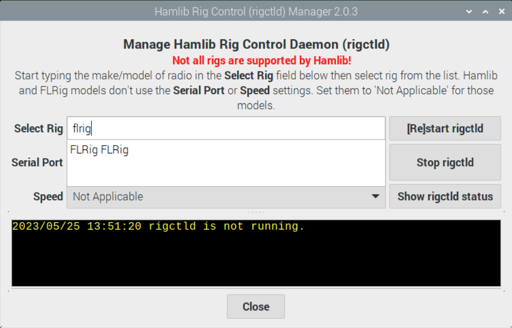
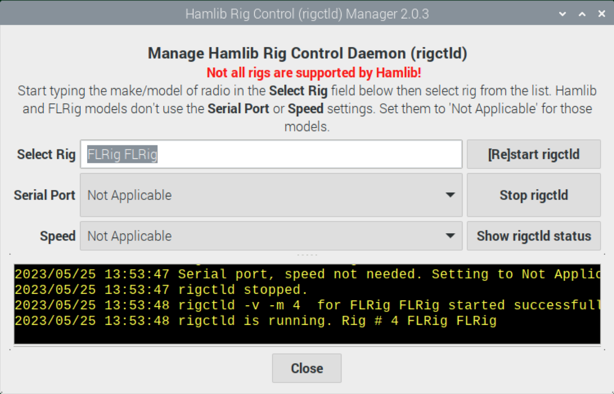

# Kenwood CAT control for TM-D710G and TM-V71A
VERSION 20230529

This script allows the user to control various parameters on the Kenwood TM-V71A and TM-D710G radios via the **PC** serial port on the back of the radio main unit (not the control panel). Kenwood does not officially support CAT on these radios, but the commands have been [extensively documented by LA3QMA](https://github.com/LA3QMA/TM-V71_TM-D710-Kenwood). 

Among the CAT commands available are **TX** and **RX**, which activate and deactivate TX on whatever side of the radio is currently set to PTT. Note that these commands transmit mic audio and not audio coming in via the radio's mini-DIN6 DATA port. When PTT is activated via the **DATA** port by bringing the PTT pin to ground, the DATA port audio is transmitted and the mic audio is muted. This activation of PTT is independent of whether the radio's displayed PTT indicator is on that same side of the radio designated as the data side. This is convenient when you want to simultaneously use, for example, the left side of the radio for voice comms and the right for digital without having to constantly move PTT between the A and B sides when you want to transmit voice or data.

This application implements an XML-RPC server, making the application appear as if  [Flrig](http://w1hkj.com/flrig-help/) is running to clients such as [Fldigi](http://w1hkj.com/FldigiHelp/index.html) or [Hamlib's](https://hamlib.github.io) **rigctld** (using the Hamlib **"flrig"** rig ). Keeping the above PTT behaviors in mind, this application is specifically designed for use in conjunction with the DATA port in certain scenarios by offering the ability to simultaneously use the DATA port for PTT and use the PC port for CAT control of other radio functions. 

When an XML-RPC client sends the RPC command to activate PTT, the script can optionally (using the `--rig <GPIO-pin>` argument) to control a GPIO pin on a Pi to activate, via a circuit driven by that GPIO pin, PTT in the radio's Mini-DIN6 DATA connector. 

If `--rig digirig` is used, when the application receives an RPC command to activate PTT it will assert __RTS__ on the serial port to the [DigiRig](https://digirig.net). In the [DigiRig](https://digirig.net) device, when the computer asserts __RTS__, the DigiRig activates a circuit that turns on PTT in the radio's DATA connector; **RTS** is not asserted on the *radio's* PC port in this case. The special DigiRig-to-radio-PC-port cable actually has RTS looped back to CTS so CAT control functions work.

If `--rig cm108[:1-8]` is used, when the application receives an RPC command to activate PTT it will activate a GPIO pin on a CM108/CM119 sound card such as found in the DRA series of products. The GPIO pin used can be specified (`--rig com108:4`, for example, will use GPIO 4). If not specified, GPIO 3 will be used as it is the most common pin for PTT control in these sound devices. If multiple CM108/CM119 devices are connected to the computer, the first one the application finds will be used.

## Releases

The releases include the following files:

- `tar.gz` of the `.py` files
- Windows 11 (probably works on 10 as well) self-contained `.exe` (does not require Python installation)

The Windows `.exe` might be problematic to run on your system since they are unsigned apps. YMMV.

## Installation

### As Python scripts 

#### Linux (including Raspberry Pi)

1. Python3 (3.8 or later) should already installed. Install it using your package manager if it isn't.

1. Install supporting packages (`apt` installation commands shown; use your distribution's package manager):

		sudo apt install libusb-dev python3-hidapi

1. Create a file `/etc/udev/rules.d/99-cmedia-gpio.rules` (root privileges needed) with these lines:
		
		SUBSYSTEM=="hidraw", ATTRS{idVendor}=="0d8c", GROUP="audio", MODE="0660"
		SUBSYSTEM=="usb", ATTRS{idVendor}=="0d8c", GROUP="audio", MODE="0660"
		
	then run:
	
		sudo udevadm control --reload-rules
		sudo udevadm trigger

#### Windows

1. [Download and Install Python](https://www.python.org/downloads/) 3.8 or later if it is not already installed. The easiest way is to install it from the Microsoft Store. 

1. Set up a virtual environment [(venv)](https://realpython.com/python-virtual-environments-a-primer/) as desired.

1. Install modules using **pip**:

		pip install pyserial hidapi
		
1. Download the source `zip` file into your `venv`, or clone this repository (`git clone https://github.com/AG7GN/kenwood`) into your `venv`.

#### MacOS

1. Python 3 should already be installed. If it's not, [download and install it](https://www.python.org/downloads/).

1. Set up a virtual environment [(venv)](https://realpython.com/python-virtual-environments-a-primer/) as desired.

1. [Install Homebrew](https://brew.sh), then run:

		brew install hidapi libusb
		pip3 install pyserial hidapi

### As binaries

The releases include `710.exe`, which was built using `pyinstaller` and Python 3.11. Since these binaries are not signed, Microsoft doesn't recognize it as a "safe" app, so your ability to use it may vary. 

- You can make your own binary for your OS by following the instructions in the previous **As Python Scripts** section, then doing the following:

	- Install the `pyinstaller` package:
	
			pip3 install pyinstaller
			
	- Note the output of the installation process. It will tell you where the `pyinstaller` binary was installed. Add that directory to your PATH or write it down somewhere.
	- Change directories to the location where the downloaded 710 python files are stored (from your `git clone` or unzip).
	- Run:
	
			pyinstaller --onefile 710.py
	
		Note that if you didn't add `pyinstaller`'s location to your path, you might have to use the full path to `pyinstaller` in order for this to work.
		
		`pyinstaller` will create a `dist` folder and in that folder will be the binary for whatever OS you are using. For example, it will create `710.exe` if run on Windows or `710.app` if run on MacOS.
	- Copy that binary to your applications folder or wherever you store your applications.

## Recent significant changes

1. Supports PTT using CM108/CM119 sound cards with GPIO (DRA series sound cards, for example).
1. GUI looks more uniform across Linux, MacOS and Windows.
1. Improvements to the way serial ports are discovered in Windows.
1. Supports [DigiRig](https://digirig.net).
1. Ability to set shift (simplex, negative or positive).
1. Changing the frequency, modulation, step, tone, tone frequency, reverse or shift in the GUI while in memory mode will now prompt the user to modify the memory or copy the memory contents to VFO and then make the modifications. If the user attempts to change the frequency to one that is not in the band currently set to that side of the radio, the user will be prompted to either modify the memory or abort the change.
1. User can select any Raspberry Pi GPIO pin for PTT, not just the 'left' and 'right' radios for the Nexus DR-X. 'left' and 'right' are still available and will map to GPIO 12 and GPIO23 respectively. **digirig** and **cat** rig options are also available now.
1. Clicking 'Up' or 'Down' when in VFO mode now more closely mimics turning the tuning knob on the radio in terms of what parameters are kept from frequency to frequency. For example, the shift setting will automatically change as frequencies traverse the ranges described in the TM-D710GA manual:

	- VHF
		
		Under 145.100 MHz:		No offset (Simplex operation)
	
		145.100 ~ 145.499 MHz: 	– 600 kHz offset
	
		145.500 ~ 145.999 MHz: 	No offset (Simplex operation)
	
		146.000 ~ 146.399 MHz: 	+ 600 kHz offset
	
		146.400 ~ 146.599 MHz:	No offset (Simplex operation)
	
		146.600 ~ 146.999 MHz:	– 600 kHz offset
	
		147.000 ~ 147.399 MHz:	+ 600 kHz offset
	
		147.400 ~ 147.599 MHz:	No offset (Simplex operation)
	
		147.600 ~ 147.999 MHz:	– 600 kHz offset
	 
		148.000 MHz and higher:	No offset (Simplex operation)

	- UHF
	
		Under 442.000 MHz:		No offset (Simplex operation)
		
		442.000 ~ 444.999 MHz:	+ 5 MHz offset
		
		445.000 ~ 446.999 MHz:	No offset (Simplex operation)
		
		447.000 ~ 449.999 MHz:	– 5 MHz offset
		
		450.000 MHz and higher:	No offset (Simplex operation)

1. `710.py` has a multithreaded XML-RPC server. This allows Fldigi (for example) to communicate with `710.py` as if `710.py` were Flrig. Apps using Hamlib can also use `710.py` by selecting the **flrig** rig in Hamlib `rigctld`. Details below.

1. `710.sh` can interact with `710.py` as it always has, by calling it and passing commands via `710.py -c COMMAND`. Now, it can also interact via XML-RPC. This means that `710.sh` can be used while `710.py` is running.

## Operation

### Prepare your radio

1. Set your radio's PC port speed: 

	|Radio|Menu #|Description|Value|
	|:---:|:---:|:---:|:---:|
	|TM-D710G|920|PC PORT BAUDRATE|57600\*| 
	|TM-V71A|519|PC.SPD|57600\*|

	The script uses `57600` as the default*, but you can change it using the `-s <speed>` argument. The speed must match the radio's setting.

1. Connect a serial cable between the radio's Mini-DIN8 **PC** port and your PC. An RT Systems programming cable will work, as will a Kenwood PG-5G cable or equivalent. 
	
	If using the [DigiRig](https://digirig.net), then connect the *special* serial cable between the radio's Mini-DIN8 **PC** port and the DigiRig's **SERIAL** port. This special cable has the RTS pin looped back to the CTS pin on the radio side of the cable.

	- The script will use the first serial port it finds by default. Override this behavior by using the `-p <port>` argument.

## Display the `help` screen

Change to the folder containing the 710 scripts and run (Linux and MacOS):

	710.py -h

or, on Windows:

	python3 710.py -h
	
or, if using the binary on Windows:

	710.exe -h 

The output will be similar to this:
```
usage: 710.py [-h] [-v] [-p {/dev/gps0,/dev/kenwoodTM-D710G,/dev/ttyUSB0,/dev/serial0,/dev/serial1,/dev/ttyS0,/dev/ttyAMA0}]
              [-b {300,1200,2400,4800,9600,19200,38400,57600}] [-s] [-l x:y] [-x {1024-65535}]
              [-r {none,cat,cm108,cm108:1,cm108:2,cm108:3,cm108:4,cm108:5,cm108:6,cm108:7,cm108:8,digirig,left,right,4,5,6,12,13,16,17,18,19,20,21,22,23,24,25,26,27}]
              [-c COMMAND]

CAT control for Kenwood TM-D710G/TM-V71A

optional arguments:
  -h, --help            show this help message and exit
  -v, --version         show program's version number and exit
  -p {/dev/gps0,/dev/kenwoodTM-D710G,/dev/ttyUSB0,/dev/serial0,/dev/serial1,/dev/ttyS0,/dev/ttyAMA0}, --port {/dev/gps0,/dev/kenwoodTM-D710G,/dev/ttyUSB0,/dev/serial0,/dev/serial1,/dev/ttyS0,/dev/ttyAMA0}
                        Serial port connected to radio (default: /dev/gps0)
  -b {300,1200,2400,4800,9600,19200,38400,57600}, --baudrate {300,1200,2400,4800,9600,19200,38400,57600}
                        Serial port speed (must match radio!) (default: 57600)
  -s, --small           Smaller GUI window (default: False)
  -l x:y, --location x:y
                        x:y: Initial x and y position (in pixels)
                        of upper left corner of GUI. (default: None)
  -x {1024-65535}, --xmlport {1024-65535}
                        TCP port on which to listen for XML-RPC
                        rig control calls from clients such as
                        Fldigi or Hamlib rigctl[d]. (default: 12345)
  -r {none,cat,cm108,cm108:1,cm108:2,cm108:3,cm108:4,cm108:5,cm108:6,cm108:7,cm108:8,digirig,left,right,4,5,6,12,13,16,17,18,19,20,21,22,23,24,25,26,27}, --rig {none,cat,cm108,cm108:1,cm108:2,cm108:3,cm108:4,cm108:5,cm108:6,cm108:7,cm108:8,digirig,left,right,4,5,6,12,13,16,17,18,19,20,21,22,23,24,25,26,27}
                        PTT device to use if you want to control 
                        PTT via an XML-RPC 'rig.set_ptt' call.
                        Pi users can specify the BCM GPIO pin number
                        driving your PTT circuit. Nexus DR-X Pi users:
                        Use 'left' or 'right'. This will map to GPIO
                        pin 12 for the left radio and pin 23 for the right.
                        
                        'none' means that 'rig.set_ptt' calls will be ignored
                        (meaning you'll control PTT by some other means).
                        
                        'digirig' is for use with the DigiRig interface
                        and associated special serial cable. Disables
                        RTS on the serial port because on the DigiRig,
                        RTS controls PTT via a separate circuit.
                        
                        'cm108[:1-8]' will activate a CM108 GPIO for PTT on
                        CM108/CM119 sound interfaces such as the DRA
                        series of sound cards. You can specify the CM108
                        GPIO pin by appending ':x' to 'cm108' where x is
                        1 through 8 inclusive. 'cm108' by itself will use
                        GPIO 3, the most commonly used GPIO for CM108 PTT.
                        If more than one CM108 sound card is attached,
                        the first one found will be used.
                        
                        'cat' will send the 'TX' or 'RX' CAT command to the
                        radio to control PTT. Note that this will transmit
                        on the side on which PTT is set and will transmit
                        mic audio, *not* DATA port audio!
                        
                         (default: none)
  -c COMMAND, --command COMMAND
                        CAT command to send to radio (no GUI) (default: None)
```

The script will attempt to identify all of the serial ports on your computer and those will be listed as options as shown above. From the above example:

```
-p {/dev/gps0,/dev/kenwoodTM-D710G,/dev/ttyUSB0,/dev/serial0,/dev/serial1,/dev/ttyS0,/dev/ttyAMA0,/dev/serial/by-id/usb-Prolific_Technology_Inc._USB-Serial_Controller_D-if00-port0}, --port {/dev/gps0,/dev/kenwoodTM-D710G,/dev/ttyUSB0,/dev/serial0,/dev/serial1,/dev/ttyS0,/dev/ttyAMA0,/dev/serial/by-id/usb-Prolific_Technology_Inc._USB-Serial_Controller_D-if00-port0}
                        Serial port connected to radio (default: /dev/gps0)
```

You can only specify a port from this list. By default, it'll use the first port it finds.

The script will listen on port `12345` for XML-RPC calls from a client program such as **Fldigi** or Hamlib `rigctl` or `rigctld`. You can change the listen port using the `-x <port>` argument.

### PTT control

When an RPC (remote Procedure Call) to control PTT is received from a client, the application will handle PTT as directed by the `-r <ptt>` option. By default, the script will ignore RPC requests to control PTT `(-r none)`, meaning you are controlling PTT by some other means.

On Linux hosts, particularly Raspberry Pis, you can select a BCM GPIO pin number `(-r <pin>)` as described in the help output above. This feature is handy if you have wired a GPIO pin to an external circuit that controls PTT on the radio's Mini-DIN6 DATA connector. When an RPC call to control PTT comes from a client application, the script will then set the configured GPIO pin to high to activate the PTT circuit and low to deactivate the PTT curcuit.

If you're using the [DigiRig](https://digirig.net) and associated special serial cable between the DigiRig and radio, use the `-r digirig` setting. This will allow simultanenous CAT control of the radio via the DigiRig's SERIAL port and PTT control of the radio via the DigiRig's AUDIO port connected to the radio's DATA port.

If `-r cm108[:1-8]` is used, when the application receives an RPC to activate PTT it will activate a GPIO pin on a CM108/CM119 sound card such as found in the DRA series of products. The GPIO pin used can be specified (`-r com108:4`, for example, will use GPIO 4). If not specified, GPIO 3 will be used as it is the most common pin for PTT control in these sound devices. If multiple CM108/CM119 devices are connected to the computer, the first one the application finds will be used.

If you use the `-r cat` argument, the script will send the Kenwood **TX** and **RX** commands to the radio when RPC calls to control PTT are received from a client application. 
**IMPORTANT:** TX will activate on whatever side of the radio currently has PTT and mic audio will be transmitted, not audio from the radio's DATA port!

### Linux and Mac: 710.py and 710.sh

- `710.sh` is a shell script that you use in the Terminal.
- `710.py` is the Python application. `710.sh` does not work with the `710` binary, only with `710.py`.

The `710.sh` script requires `710.py` to talk to the radio. It does not start the `710.py` GUI in this case. `710.py` uses the Python serial library to communicate with the radio. 

### Operating `710.sh`
- Open a terminal and run:
  
		710.sh -h
	and follow the instructions.  

- `710.sh` will attempt to communicate with the radio via `710.py` in one of 2 ways:

	1.	__If `710.py` IS ALREADY running:__ `710.sh` will use XML-RPC to send the command to `710.py`, which will in turn send the command to the radio. This is the slower of the 2 ways to communicate with the radio, but has the advantage that `710.py` can be running when you send your commands.

	2. __If `710.py` IS NOT running:__ `710.sh` will attempt to start `710.py` in non-GUI "one shot" mode. No GUI will open, but `710.py` will send the command passed to it by `710.sh`, return the results to `710.sh`, and then exit. This is the way that `710.sh` operated in previous versions and returns data faster than the first method.

		If you use the second method, the script will look for USB-serial cables (represented as files) in `/dev/serial/by-id` unless you specify the serial port with `-p`.  If any of the devices listed have filenames that contain any of these strings, then the script will automatically select and use that cable to communicate with the radio:

		- USB-Serial
		- RT_Systems
		- usb-FTDI

		If more than one cable matches, it'll use the last matching file name alphabetically.

		To view the list of files that represent the USB-serial cables, open a terminal and run this command:

			ls -al /dev/serial/by-id

## CAVEATS

- Kenwood does not provide a CAT command to change the frequency band on a given side of the radio. You can only change the frequency band on the radio itself. This omission causes the following behaviors:

	1. When in VFO mode, you cannot select a frequency outside the frequency band set for that side. 

	1. Changing the frequency, modulation, step, tone, tone frequency, reverse or shift in the GUI while in memory mode will prompt the user to modify the memory or copy the memory contents to VFO and then make the modifications. While in VFO mode, if the user attempts to change the frequency to one that is not in the band currently set on that side of the radio, the user will be prompted to either modify the memory or abort the change.
	
	1. If you use the shell script (`710.sh`) on Linux/MacOS to change the frequency, the script will first change the mode to VFO (if it's not already in that mode) and attempt to set the desired frequency. If the desired frequency is not in the currently set frequency band for that side, the frequency will not be changed. 

	The workaround for the inability to use CAT to change the frequency band is to set your commonly used frequencies in memory locations and use the scripts to put the radio in MR mode and set a certain memory channel. One easy way to program the radio's memories is to use `chirp`. `chirp` uses the same serial/USB cable as the `710` scripts. 
	
	Here are some tips for using `chirp`:
	
	1. Close the `710` application while running `chirp`. Only one program can access the serial port at a time.
	1. For the TM-D710G: Select __TM-D710G__ and not TM-D710G_CloneMode. Select __TM-V71__ for that radio.
	1. All changes you make in `chirp` are immediately sent to the radio. There is no "update" or "send to radio" action to take.

- Unlike the radio's display, the application's GUI will not display the TX frequency while PTT is active.

## OPTIONAL (Linux only): Add a `udev` rule for your USB-serial cable

This is optional but recommended and will ensure that your radio's cable always is identified as the same serial port name on your computer.

1. With your USB-serial cable for your radio __unplugged__ from the computer, run this command in the Terminal:

		lsusb
	
	For example:
	
		pi@nexuspi4b-ag7gn:~ $ lsusb
		Bus 002 Device 002: ID 0bda:0316 Realtek Semiconductor Corp. Card Reader
		Bus 002 Device 001: ID 1d6b:0003 Linux Foundation 3.0 root hub
		Bus 001 Device 010: ID 067b:2303 Prolific Technology, Inc. PL2303 Serial Port / Mobile Action MA-8910P
		Bus 001 Device 002: ID 2109:3431 VIA Labs, Inc. Hub
		Bus 001 Device 001: ID 1d6b:0002 Linux Foundation 2.0 root hub

1. Connect your USB-serial cable to a USB port on your computer. Your radio does not have to be powered on.

1. Run `lsusb` again. 

	For example:

		pi@nexuspi4b-ag7gn:~ $ lsusb
		Bus 002 Device 002: ID 0bda:0316 Realtek Semiconductor Corp. Card Reader
		Bus 002 Device 001: ID 1d6b:0003 Linux Foundation 3.0 root hub
		Bus 001 Device 010: ID 067b:2303 Prolific Technology, Inc. PL2303 Serial Port / Mobile Action MA-8910P
		Bus 001 Device 011: ID 0403:6001 Future Technology Devices International, Ltd FT232 Serial (UART) IC
		Bus 001 Device 002: ID 2109:3431 VIA Labs, Inc. Hub
		Bus 001 Device 001: ID 1d6b:0002 Linux Foundation 2.0 root hub

1. Note the differences between the outputs of the two runs. In this example, the second run of `lsusb` has one additional line:

		Bus 001 Device 011: ID 0403:6001 Future Technology Devices International, Ltd FT232 Serial (UART) IC

	That's the cable you just plugged in. We'll create a `udev` rule so that this serial port has a consistent name, which we'll call `kenwoodTM-V71A`. You can use whatever name you like. Don't use any spaces in your name and keep it simple and memorable.
	
1. The rule will use the ID information to identify that particular cable. In this example, the ID is `0403:6001`. Your cable will likely have a different ID. The ID consists of 2 parts: The part before the `:` is the `idVendor` and the part after the `:` is the `idProduct`.

1. The rule is defined in a file in `/etc/udev/rules.d`. To make the rule file, enter these commands in the Terminal using the ATTR values for your cable and whatever name you've decided to use (Note that after the 1st two commands, you'll get a `>` prompt):

		cat >99-kenwood.rules <<EOF
		SUBSYSTEM=="tty", ATTRS{idVendor}=="0403", ATTRS{idProduct}=="6001", SYMLINK+="kenwoodTM-V71A"
		EOF
		sudo mv 99-kenwood.rules /etc/udev/rules.d/
		sudo udevadm control --reload
		
	For example:
	
		pi@nexuspi4b-ag7gn:~ $ cat >99-kenwood.rules <<EOF
		> SUBSYSTEM=="tty", ATTRS{idVendor}=="0403", ATTRS{idProduct}=="6001", SYMLINK+="kenwoodTM-V71A"
		> EOF
		
		pi@nexuspi4b-ag7gn:~ $ sudo mv 99-kenwood.rules /etc/udev/rules.d/
		pi@nexuspi4b-ag7gn:~ $ sudo udevadm control --reload
		pi@nexuspi4b-ag7gn:~ $ sudo udevadm trigger

1. For good measure, unplug your USB-serial cable from your computer and plug it back in.

1. Now you'll see your serial port in `/dev/`. Run `ls -al /dev/ken*` to see it. 

	For example:

		pi@nexuspi4b-ag7gn:~ $ ls -al /dev/ken*
		lrwxrwxrwx 1 root root 7 Jan 30 16:15 /dev/kenwoodTM-V71A -> ttyUSB1

1. From now on, your serial port will be called `/dev/kenwoodTM-V71A` even if you disconnect/reconnect the cable or reboot the computer.

### Distinguishing between cables of the same make/model

__IMPORTANT:__ If you have 2 USB-Serial cables of the same make and model attached to your computer, they'll both have the same idVendor and idProduct value. In that case you'll need to use additional or alternate criteria to tell them apart. These devices have a lot of attribute (ATTRS) values, so you might find that one of the ATTRS is a serial number of some sort. Here's how:

1. Make sure your cable is plugged in to your computer
1. Identify the port you want to query (ex. `/dev/ttyUSB0`, `/dev/ttyUSB1`). In this example, we'll use the one we just set up: `/dev/KenwoodTM-V71A`:

		pi@nexuspi4b-ag7gn:~ $ udevadm info -q property -n /dev/kenwoodTM-V71A
		
		DEVPATH=/devices/platform/scb/fd500000.pcie/pci0000:00/0000:00:00.0/0000:01:00.0/usb1/1-1/1-1.1/1-1.1:1.0/ttyUSB1/tty/ttyUSB1
		DEVNAME=/dev/ttyUSB1
		MAJOR=188
		MINOR=1
		SUBSYSTEM=tty
		USEC_INITIALIZED=270367968798
		ID_BUS=usb
		ID_VENDOR_ID=0403
		ID_MODEL_ID=6001
		ID_PCI_CLASS_FROM_DATABASE=Serial bus controller
		ID_PCI_SUBCLASS_FROM_DATABASE=USB controller
		ID_PCI_INTERFACE_FROM_DATABASE=XHCI
		ID_VENDOR_FROM_DATABASE=VIA Technologies, Inc.
		ID_MODEL_FROM_DATABASE=VL805 USB 3.0 Host Controller
		ID_PATH=platform-fd500000.pcie-pci-0000:01:00.0-usb-0:1.1:1.0
		ID_PATH_TAG=platform-fd500000_pcie-pci-0000_01_00_0-usb-0_1_1_1_0
		ID_VENDOR=FTDI
		ID_VENDOR_ENC=FTDI
		ID_MODEL=FT232R_USB_UART
		ID_MODEL_ENC=FT232R\x20USB\x20UART
		ID_REVISION=0600
		ID_SERIAL=FTDI_FT232R_USB_UART_AI05SMCB
		ID_SERIAL_SHORT=AI05SMCB
		ID_TYPE=generic
		ID_USB_INTERFACES=:ffffff:
		ID_USB_INTERFACE_NUM=00
		ID_USB_DRIVER=ftdi_sio
		DEVLINKS=/dev/serial/by-id/usb-FTDI_FT232R_USB_UART_AI05SMCB-if00-port0 /dev/kenwoodTM-V71A /dev/serial/by-path/platform-fd500000.pcie-pci-0000:01:00.0-usb-0:1.1:1.0-port0
		TAGS=:systemd:
		CURRENT_TAGS=:systemd:

1. Note that there are 2 serial number items in the property list:

		ID_SERIAL=FTDI_FT232R_USB_UART_AI05SMCB
		ID_SERIAL_SHORT=AI05SMCB

	__NOTE:__ Not all USB-serial cables have serial numbers or another way to distinguish one cable from another of the same make/model. In that case, you'll have to use a cable from a different vendor so you can tell them apart.

1. Now, find out the actual ATTRS name for the serial number. We'll use the `ID_SERIAL_SHORT` item, which is `AI05SMCB` in this example. Run `udevadm info -q property -n /dev/kenwoodTM-V71A --attribute-walk | grep AI05SMCB`:

		pi@nexuspi4b-ag7gn:~ $ udevadm info -q property -n /dev/kenwoodTM-V71A --attribute-walk | grep AI05SMCB
		
		ATTRS{serial}=="AI05SMCB"
			 
1. Now we can use that ATTR to distinguish between cables with the same make/model. Our current `/etc/udev/rules.d/99-kenwood.rules` looks like this:

		SUBSYSTEM=="tty", ATTRS{idVendor}=="0403", ATTRS{idProduct}=="6001", SYMLINK+="kenwoodTM-V71A"

	Modify that file (open it in a text editor as `sudo`) and add our new serial attribute so it looks like this:
	
		SUBSYSTEM=="tty", ATTRS{idVendor}=="0403", ATTRS{idProduct}=="6001", ATTRS{serial}=="AI05SMCB", SYMLINK+="kenwoodTM-V71A"
	
1. Save the file, exit your editor and run:

		sudo udevadm control --reload
		
1. Unplug and re-plug in your cable.

### Make a Hamradio menu selection (Pi)

Installing these scripts as per the directions above does not automatically create a Hamradio menu item because it is not possible to know in advance your system's serial port that will be used to communicate with the radio. You can make your own Hamradio menu item as described here. Some sleuthing might be needed to identify your radio's serial port if you haven't already done so.

1.	If you haven't already determined the serial port name for your radio's cable, here's one way to do it:

	- Unplug your USB-serial cable from your Pi.
	- Open a Terminal on your Pi and run this command:

			dmesg -w -H 
		
		You'll see lots of output and then it'll pause and wait for some event to happen (like plugging in a USB device).
	- Plug your USB-serial cable into your Pi (the radio does not have to be on).
	- You should see some `dmesg` output appear in your Terminal. It'll look something like this:

			[Jan28 15:00] usb 1-1.4: new full-speed USB device number 4 using xhci_hcd
			[  +0.134526] usb 1-1.4: New USB device found, idVendor=067b, idProduct=2303, bcdDevice= 4.00
			[  +0.000009] usb 1-1.4: New USB device strings: Mfr=1, Product=2, SerialNumber=0
			[  +0.000006] usb 1-1.4: Product: USB-Serial Controller D
			[  +0.000006] usb 1-1.4: Manufacturer: Prolific Technology Inc. 
			[  +0.002693] pl2303 1-1.4:1.0: pl2303 converter detected
			[  +0.009797] usb 1-1.4: pl2303 converter now attached to ttyUSB1

	- In this example, that last line tells you that the USB-Serial cable you plugged in is "`...now attached to ttyUSB1`". So, the serial port in this example is `/dev/ttyUSB1`. Yours may be different. With that information, you can now make a `desktop` file. Note that this example desktop file will launch `710.py` in "small" mode so it doesn't occupy so much screen real estate.

1. Create your `desktop` file
	- Using your favorite text editor, create a file called `$HOME/.local/share/applications/kenwoodtm.desktop`. Here's one way to do that:
	
		- Click __Raspberry > Run__
		- In the __Run__ window, enter:
		
				mousepad $HOME/.local/share/applications/kenwoodtm.desktop
			
			That will open a text editor similar to Notepad on Windows.

	- Enter this text in the file:

			[Desktop Entry]
			Name=TM-D710G/TM-V71A Controller
			Comment=Kenwood TM-D710G/TM-V71A Controller
			Exec=sh -c "710.py -p /dev/kenwoodTM-V71A -r right --small >/dev/null 2>&1"
			Icon=hamradio.png
			StartupNotify=true
			Terminal=false
			Type=Application
			Categories=HamRadio
			Keywords=Ham Radio;Rig Control

	- Change the `Exec=` line to add/remove/modify arguments for your particular serial port/speed. If you're just using the `dmesg` output to determine the serial port name, then you'd use `-p /dev/ttyUSB1` in the example above and using the `dmesg` example output above. Again, your port names may be different. Omit the `--small` if you want to run the GUI in regular size. 
	
		If you want GPIO PTT control via XML-RPC, also specify `-r left` or `-r right` for the left or right radios respectively (those map to BCM GPIO pins 12 and 23 respectively on the Nexus DR-X). This is only needed if you want to control PTT via XML-RPC.

	- Change the `Name=` line to suit. This is how it will appear in the Hamradio menu.

	- Save the file and close your editor. The new menu item should appear at the bottom of your __Raspberry > Hamradio__ menu.

### Usage with Fldigi

`710.py` runs an XML-RPC server on port `12345` by default. You can change the port using the `-x <port-number>` argument when you launch `710.py`. Port `12345` is the default XML-RPC port for Fldigi (on the Nexus DR-X: Left Radio. It is `12346` for the right radio).

1. Launch `710.py` either from the command line or via your new menu item.

1. In Fldigi, select __Configure > Rig Control > flrig__. Assuming you're using the default port of `12345`, configure these settings:

	
	
	If you used the `-x <port-number>` option to change the port, you must use that same port in the configuration above.
	
1. Click the __Reconnect__ button to tell Fldigi to set up a new XML-RPC connection to `710.py`.

1.	Click __Save__, then __Close__.

1. You should now be able to change the frequency from Fldigi's frequency field, from `710.py` by clicking on the frequency or by adjusting the frequency on the radio itself.

	__NOTE:__ Setting the frequency in Fldigi will only change the frequency on the side of the radio set for Digital. This is regardless of what side has **CTRL** set.

### Using `710.py` with Hamlib

Hamlib can send commands and receive state information from Flrig. `710.py` can be used as a substitute for Flrig.

Nexus DR-X users can use the __Hamlib Rig Control GUI__ to manage Hamlib.

- Start the `710.py` script. 
	- Be sure to use the default port of `12345` (in other words, don't specify a different port with the `-x` option). Hamlib will only work over port `12345`. 
	- If you want Hamlib to control PTT, then run `710.py` with `-r <option>` to control the left or right radio. This is needed for apps that cannot control GPIO PTT directly and so must rely on Hamlib for PTT. Fldigi and Direwolf can control GPIO PTT directly.
- Run __Raspberry > Hamradio > Hamlib Rig Control GUI__ 
- Enter `flrig` in the Select Rig field, then select **FLRig FLRig** from the list. 

	

- Set the __Serial Port__ and __Speed__ fields to __Not Applicable__.
- Click ___[Re]start rigctld__.
- You should now see that rigctld is running in the text box above the **Close** button.

	


- Applications that use Hamlib for rig control (and PTT if you launched `710.py` with `-r <option>`) should now work with the Kenwood radio.

__IMPORTANT:__ If you close `710.py` while `rigctld` is running, you might have to restart `rigctld` again once `710.py` is running.
